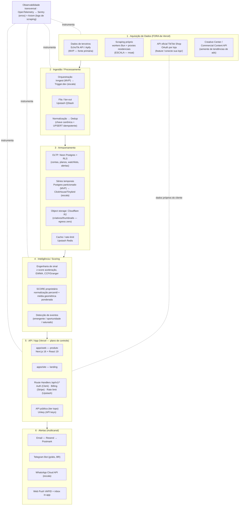

# Infraestrutura e Arquitetura Técnica — TIKSPY

**Data:** 2026-06-09
**Status:** Documento de arquitetura (decisões fundantes + roadmap MVP enxuto → escala)
**Lema do produto:** "Descubra onde o dinheiro está antes dos outros."

> **Aviso sobre dados deste documento.** Preços, limites e termos citados são *snapshots* de junho/2026 e mudam com frequência (vários fornecedores — Neon, ClickHouse, Tinybird, MotherDuck, Kalodata, FastMoss, Render, Trigger.dev — reprecificaram em 2025–2026). **Reconfirme na fonte antes de qualquer decisão financeira.** Os valores mais voláteis são os de proxy/scraping e os tiers Enterprise (que os fornecedores divulgam apenas como "custom/contato comercial").

---

## 1. Princípios de Arquitetura

O TIKSPY é um SaaS de inteligência de mercado para o ecossistema do TikTok Shop. A infraestrutura é guiada por quatro princípios:

1. **MVP enxuto → escala.** Começar barato e rápido de validar; só pagar por infra dedicada quando o volume e a margem justificarem.
2. **Barato de validar.** Maximizar *free tiers* e serviços *scale-to-zero* (Neon, Vercel, Upstash, Inngest). O gasto dominante no MVP deve ser a **aquisição de dados** — exatamente o que se quer medir na validação — e não a plataforma.
3. **Evoluir sem reescrever.** Fronteiras de módulo claras desde o dia 1: a **fonte de dados é uma camada substituível** atrás de uma interface interna; a lógica de negócio mora em `packages/*` agnósticos; a API é versionada (`/api/v1/*`); a instrumentação usa OpenTelemetry (troca de backend sem reinstrumentar).
4. **Separar plano de controle de plano de dados.** O produto (auth, billing, dashboards, API) é leve e *Vercel-friendly*. A **coleta/crawling** é pesada, de longa duração e hostil a serverless — vive **fora da Vercel** desde o desenho.

### A decisão que domina tudo: a fonte de dados

O ponto mais crítico e de maior risco **não é tecnológico, é de fonte de dados**. A pesquisa confirma, de forma consistente em todas as frentes, que:

> **A API oficial do TikTok Shop (Partner / Affiliate / Seller API) é escopada à conta/loja autorizada via OAuth.** Ela entrega dados da *sua* loja (produtos, pedidos, inventário, finanças, performance de afiliado próprio) e permite *busca de criadores no marketplace por GMV/keywords/demografia* e *busca de produtos com colaboração aberta*. **Mas NÃO entrega inteligência competitiva ampla** — não há endpoint de "todos os produtos vendendo no mercado", GMV de lojas concorrentes, ranking de virais cross-market ou criativos de terceiros.

Logo, o **núcleo do TIKSPY** (descoberta de produtos explodindo/emergentes de terceiros, espionagem competitiva de criativos, SCORE proprietário) **depende de dados públicos coletados** — via **dados de terceiros** (EchoTik/Kalodata/FastMoss/Apify) ou **scraping próprio**. Ambos carregam risco de ToS, anti-bot e LGPD que precisa de mitigação arquitetural e jurídica.

> **Observação de posicionamento (compliance, não opcional).** Todos os fornecedores de dados de terceiros entregam **estimativas** de canais públicos; nenhum garante 100% de acurácia (a própria Kalodata admite variação e desaconselha uso de alta precisão, ficando ~12–15% atrás em GMV de live). O copy "**dados reais de venda em tempo real**" é juridicamente arriscado. Use algo defensável como "**estimativas de venda em tempo quase real**".

---

## 2. Visão Geral da Arquitetura

**Leitura do diagrama.** Os dados entram pela camada de Aquisição (terceiros no MVP, scraping próprio na escala), passam por Ingestão (orquestração + fila + dedup idempotente), são gravados em Armazenamento (OLTP separado de séries temporais e mídia), processados pela Inteligência (sinal + SCORE), expostos pela App/API (plano de controle na Vercel) e entregues como Alertas multicanal. A Observabilidade atravessa todas as camadas.

---

## 3. Camada de Aquisição de Dados

Esta é a decisão fundante. Apresentamos as opções e recomendamos uma — **a decisão final é do usuário.**

> **Registro de fornecedores:** os candidatos a fonte de dados (EchoTik como nº 1 em avaliação, Apify e demais) estão catalogados em [fornecedores.md](./fornecedores.md) — endpoints, auth, limites e pendências de validação de cada um. A fonte pode ser composta por mais de um fornecedor; nada está fechado até as validações de trial.

### 3.1 Trade-offs das opções

| Opção | Cobertura de mercado | Custo | Legalidade / ToS | Confiabilidade | Esforço de engenharia |
|---|---|---|---|---|---|
| **API oficial TikTok Shop** (Partner/Affiliate/Seller) | **Nenhuma** para concorrentes — só a própria loja autorizada + busca de criadores/produtos com colaboração aberta | Grátis (só custo de integração OAuth/webhooks) | **Total** — dentro do ToS, sem risco anti-bot | Alta (dados oficiais, exatos, tempo real) | Médio (OAuth, webhooks, onboarding 2–3 dias úteis) |
| **Dados de terceiros / revenda** (EchoTik, Kalodata, FastMoss, Apify) | **Ampla** — produtos, shops, criadores, vídeos, GMV estimado, rankings | EchoTik ~US$9–19/mês + ~¥0,001/req; Apify ~US$2–10/1.000; FastMoss/Kalodata enterprise *custom* | Cinza — risco herdado da fonte; **revenda pode ser proibida no contrato do fornecedor** | Média — dados **estimados** (variação admitida) | **Baixo** — só chamadas HTTP, *Vercel-friendly* |
| **Scraping próprio** (TikTok Shop + perfis + Creative Center) | **Total** — controle de campos, frescor e cobertura (foco BR) | Proxies residenciais US$2,5–8,5/GB + scraping gerenciado + engenharia dedicada (centenas a milhares/mês) | **Risco real** — ToS proíbe explicitamente; quebra de contrato + LGPD | Frágil — quebra a cada update do TikTok | **Alto** e contínuo (anti-bot "Very Hard" 5/5) |

### 3.2 Detalhe das opções

**API oficial TikTok Shop (Partner / Affiliate Seller API).** Acesso por OAuth, **escopado por loja** — o app só lê dados de lojas que autorizarem. Rate limit oficial documentado é de **3 QPS** (shop info/certification/decoration) a ~**10 QPS** (alguns endpoints de shop management) **por endpoint** — *não* os "50 req/s" frequentemente citados de forma imprecisa. A Affiliate API (GA 2024) entrega: busca de criadores por GMV/keywords/demografia, busca de produtos com colaboração aberta, criação/gestão de campanhas, geração de links e tracking de pedidos do próprio afiliado. Onboarding de developer ~2–3 dias úteis. **Conclusão:** não serve como fonte primária de inteligência de mercado; serve como **feature complementar "conecte sua loja/conta de afiliado"** (dados próprios do cliente).

**TikTok Research API — descartar.** Restrita a universidades/ONGs sem fins comerciais (US/EEE/UK/Suíça; ONGs UE; pesquisadores acadêmicos do Brasil). **Proíbe uso comercial** → inelegível para um SaaS.

**Creative Center + Commercial Content API — camada complementar.** O **Creative Center** (`ads.tiktok.com/business/creativecenter`) é **gratuito, sem login**, com "Top Products" e "Top Ads" filtráveis por região/categoria/período — excelente **semente de tendências de criativo**. Porém **não tem API** (só UI). A **Commercial Content API** é oficial para metadados de anúncios, mas **exige aplicação/aprovação** (~2 dias úteis) e **cobre só dados de anúncios da UE** nesta fase — não é acesso aberto, e cobre ads, não GMV orgânico.

**Dados de terceiros — a via pragmática para o MVP.** Já resolveram o scraping em escala e entregam a visão de mercado que o TIKSPY precisa. **EchoTik** tem **API formal documentada** (`echotik.live/en/api-service`): endpoints de Creator, Video, Live, Product, Shop e Market Trends; **100 chamadas grátis** para teste; custo por requisição tão baixo quanto **¥0,001 no plano anual**. FastMoss e Kalodata oferecem API enterprise (custom). **Apify** tem actors prontos de TikTok Shop (~US$2–10/1.000 resultados — trate como ordem de grandeza, varia por actor).

**Scraping próprio — moat de escala, não MVP.** O TikTok é classificado **"Very Hard" (5/5)** em anti-bot: WAF customizado, fingerprint de dispositivo/TLS, "device integrity", ML comportamental, fraud scoring em tempo real, headers criptografados. Bloqueia IPs de datacenter facilmente; exige **proxies residenciais/móveis** + browser headless stealth; volume seguro ~100–200 perfis/dia por IP. O ToS proíbe scraping explicitamente (Seção 3.4 do ToS US: *"scrape, crawl, export or otherwise extract any data or content ... using any automated system ... except as approved in writing"*). `robots.txt` bloqueia `/shop/view/product/`, `/search`, etc.

### 3.3 Recomendação

**MVP — comece com API de terceiro especializada como fonte primária, EchoTik como primeira escolha** (API formal, 100 chamadas grátis, custo por requisição muito baixo), combinada com o **Creative Center** (gratuito) como camada complementar de tendências de criativo. É *Vercel-friendly* (apenas chamadas HTTP server-side), valida os 4 pilares em dias e transfere o risco anti-bot ao fornecedor. Use a **API oficial apenas como feature "conecte sua loja"** (dados próprios do cliente).

**Antes de embutir:** (a) **leia a licença/ToS do fornecedor** para confirmar que **revenda/exibição** dos dados dentro de um SaaS é permitida — esse é o risco que de fato "pega" (quebra de contrato, não CFAA); (b) **valide empiricamente a cobertura do Brasil** nas 100 chamadas grátis (TikTok Shop BR é recente — mai/2025 — e a profundidade tende a ser menor que US/UK/SEA); (c) ciente de que FastMoss/Kalodata são **produto final concorrente** e tipicamente **não licenciam dados brutos** — EchoTik é o mais plausível como *data API*.

**Escala — evolua em três frentes** para reduzir dependência, baixar custo unitário e ganhar dados exclusivos: (1) **pipeline de scraping próprio** fora da Vercel, começando pelas áreas de maior valor e priorizando a **cobertura BR** onde os concorrentes são fracos; (2) **API oficial "conecte sua loja"** como diferencial premium legalmente sólido; (3) **Commercial Content API** para enriquecer inteligência de anúncios. Mantenha o fornecedor de terceiro como *fallback*/baseline.

> O diferencial do TIKSPY **não é a posse do dado bruto** — é o **SCORE proprietário** e o **cruzamento conteúdo × venda** em cima dele, mais a **UX em PT-BR** para o público brasileiro.

### 3.4 Riscos legais (resumo)

- **ToS / contrato.** Em *hiQ v. LinkedIn* (9º Circuito, 2022) decidiu-se que raspar dados **públicos** provavelmente não viola o CFAA — **mas a hiQ perdeu na prática**: acordo de **US$500.000** (dez/2022), com responsabilidade por quebra de contrato, *trespass*, *misappropriation* e uma violação de CFAA ligada a **contas falsas/acesso protegido**, mais injunção permanente. *Meta v. Bright Data* (jan/2024) reforçou que coleta **logged-off** de dado público não viola ToS, e considerou inexequível a cláusula de "survival". **Lição:** colete **apenas dado público, sem login e sem contas falsas**; ToS, copyright e DMCA 1201 (caso *Reddit v. Perplexity*) seguem como riscos. Esses precedentes são **dos EUA e não se transferem ao Brasil**.
- **LGPD (Brasil).** O Radar Tecnológico nº 3 da ANPD (nov/2024) trata **web scraping como tratamento de dados pessoais** sujeito à LGPD, com fiscalização ativa em 2025. Criadores/consumidores são pessoas físicas → exigem **base legal** (legítimo interesse com finalidade/boa-fé), **minimização** e **política de retenção**. **Obtenha parecer jurídico brasileiro** antes de internalizar scraping. Atenção também a transferência internacional (Clerk/Supabase guardam dados fora do BR → DPA).

---

## 4. Coleta / Scraping em Escala

Só relevante na **fase de escala**. No MVP, terceiros resolvem.

**Anti-bot.** O TikTok exige **proxies residenciais/móveis** (geo-matched, com rotação inteligente) + **browser headless stealth** (Playwright/Puppeteer). Stealth de browser sozinho não basta — vaza `navigator.webdriver`, e não resolve IP reputation, TLS fingerprint nem análise comportamental. Volume seguro ~100–200 perfis/dia por IP.

**Custo de proxy (maior centro de custo variável na escala):**

| Tier | Provedores | Preço residencial (2026) |
|---|---|---|
| Enterprise | Bright Data, Oxylabs | US$8,5–12/GB (cai a ~US$2–2,5/GB em escala/compromisso) |
| Mid-market | Decodo (ex-Smartproxy), SOAX, NetNut | US$3–6/GB |
| Budget | IPRoyal, Webshare | a partir de ~US$1,75/GB |

**Scraping gerenciado (abstrai anti-bot — bom meio-termo):**

| Provedor | Preço | Nota |
|---|---|---|
| **Zyte API** | HTTP a partir de US$0,13/1.000 (simples); browser de ~US$1,00 até ~US$16/1.000 (pior caso) | Cobra só sucesso; escolhe a tecnologia mais barata por site; ~93% de sucesso em alvos protegidos |
| **Bright Data Web Unlocker** | ~US$1,5/1.000 (PAYG), caindo a US$1,0–1,3/1.000 em volume | Tem coletor específico de TikTok Shop |
| **Apify** | actors de TikTok Shop ~US$2–10/1.000 resultados; plataforma Starter US$29/mês, Scale US$199/mês | Cobertura majoritariamente US — **validar BR** |
| **Firecrawl** | Hobby US$16/mês (5k páginas) | — |

**Arquitetura.** Crawling **NÃO roda em funções serverless da Vercel** (limites de duração; cobrança por CPU ativa). Use **workers dedicados em runtime Bun** (imagem `oven/bun` em Render, Fly.io, Railway ou VPS; **Cloudflare Workers é exceção** — roda workerd/V8, não Bun) com **filas** (Upstash QStash, Cloudflare Queues), pool de proxies, rotação de user-agent e **monitoramento da taxa de bloqueio**. Trate o **GB de proxy como o KPI de custo nº 1**; aplique cache agressivo e dedup de requests.

---

## 5. Ingestão e Processamento

Pipeline desacoplado: **ingestão → fila → normalização → deduplicação → armazenamento**. Mantenha uma **interface única de "fonte de dados"** (adapter) para trocar provedor sem reescrever o produto.

### 5.1 Orquestração / scheduling

| Ferramenta | Free tier | Pago | Modelo | Melhor para |
|---|---|---|---|---|
| **Inngest** | 50k execuções/mês, 5 steps concorrentes | Pro a partir de **US$75/mês** (1M exec; overage ~US$50/1M) | Step functions duráveis, fan-out, retry por step, *event-driven*; roda **sobre** suas funções Next.js; **não** self-hostável | **MVP e início de escala** — orquestração e alertas |
| **Trigger.dev** | ~10k runs/mês + US$5 crédito compute | Hobby US$10/mês; Pro US$50/mês | Compute dedicado **sem timeout serverless**; **Apache 2.0 self-hostável**; cobra compute/seg + US$0,000025/run; Hobby 25 runs concorrentes | **Crawls longos na escala**; hedge contra lock-in |
| **Upstash QStash** | 1.000 msgs/dia + 10 schedules (não 1.000) | US$1/100k msgs; fixos US$180/mês (1M/dia), US$420/mês (10M/dia) | Fila HTTP/REST, retries automáticos, DLQ, agenda até 1 ano | Buffer leve / fan-out barato |
| **Vercel Cron** | Hobby: **1x/dia** | Pro: cadência por minuto, 100 crons/projeto | **Sem retry nativo**; só dispara jobs leves | Gatilho que enfileira no QStash/Inngest |

> **Atenção Vercel Cron.** No Hobby, cron roda **no máximo 1x/dia** — inviável para alertas frequentes. Crons da Vercel **não têm retry nativo**. Use o cron apenas como **gatilho** que enfileira; nunca para o trabalho pesado.

### 5.2 Idempotência e processamento incremental (requisito de dia 1)

Toda ingestão (webhook, scraping, pull de API) é **at-least-once** — *exactly-once* é responsabilidade do consumidor. Padrões obrigatórios:

- **Chave natural + UPSERT.** Ex.: `(produto_id, data_snapshot)` ou `(shop_id, produto_id, dia)`; upsert idempotente.
- **Tabela de eventos processados** com TTL > janela de retry; ou hash de conteúdo estável sobre campos imutáveis.
- **Batch por partição.** Re-runs **sobrescrevem a partição inteira** (nunca *append*) para convergir.
- **Watermark/cursor por janela** (ex.: por dia × produto) para o incremental de séries de vendas.
- **Job de reconciliação** periódico que compara contagens/PKs contra a fonte e faz backfill de gaps.

> Sem dedup + reconciliação, a série de vendas infla e **distorce o SCORE** — é falha silenciosa e cara de corrigir depois.

---

## 6. Armazenamento

Separar três cargas: **OLTP transacional**, **analítico/séries temporais** e **busca/ranking**. Mais **object storage** e **cache**.

### 6.1 Recomendações por carga

**OLTP — Neon Postgres (via Vercel Marketplace).** Serverless com **scale-to-zero**, integração first-party Vercel (a Vercel migrou o antigo Vercel Postgres para Neon em Q4-2024/Q1-2025), database branching. Free: **100 CU-h/mês** + 0,5 GB/projeto. Launch: **US$0,14/CU-h** + storage ~US$0,30/GB-mês (primeiros 50 GB); **sem mínimo mensal contratual** (pay-as-you-go). Guarda contas, assinaturas, watchlists, alertas e estado de jobs. **Alternativa:** Supabase (US$25/mês Pro, traz Auth+Realtime+Storage juntos), mas o **free pausa após 1 semana inativo** — ruim para coleta contínua.

**Séries temporais / OLAP — adiar engine dedicada no MVP.** Use o próprio Postgres com **tabelas particionadas por tempo + materialized views** (refresh via cron) para rankings, séries e SCORE. Custo ~zero enquanto o volume é baixo. **Gatilho de migração:** quando agregações ficarem lentas ou passar de ~dezenas de milhões de linhas → mover para **ClickHouse Cloud** (colunar, storage US$25,30/TB-mês, compute Basic US$0,2181/unidade-h, **egress US$0,1152/GB**) ou **Tinybird** (ClickHouse gerenciado com **API HTTP nativa** que serve agregações direto ao frontend — Free *time-unlimited*; Developer US$25–299/mês; o antigo limite de "10 QPS" foi **removido**).
> **Nota sobre TimescaleDB:** está **deprecado no Supabase** (removido no Postgres 17). Para séries em escala, prefira **Timescale Cloud**, **Neon** (extensão Apache-2) ou **particionamento nativo + pg_partman**, não "TimescaleDB no Supabase".

**Busca/ranking — Postgres FTS no MVP.** `tsvector`/`tsquery` + índice GIN + `pg_trgm` (fuzzy) + `pgvector` (similaridade do SCORE) é "good enough" para milhões de documentos com latência sub-segundo. Zero infra extra. **Escala:** motor dedicado quando relevância/typo-tolerance virar diferencial — **Meilisearch** (storage em disco, escala melhor por dólar, ~US$30/mês cloud) ou **Typesense** (RAM, ~US$7–58/mês).

**Object storage — Cloudflare R2.** **EGRESS ZERO** é decisivo para servir thumbnails/vídeos de criativos sem explodir a fatura. Storage US$0,015/GB-mês, Class A US$4,50/M, Class B US$0,36/M, free 10 GB. API compatível com S3. (S3 cobra **US$0,09/GB de egress** — ~30x mais caro para servir mídia. Backblaze B2 US$0,006/GB + egress grátis via Cloudflare.)

**Cache / rate-limit — Upstash Redis (via Vercel Marketplace).** Serverless HTTP (funciona em edge/serverless sem conexão persistente). Free 256 MB + 500k comandos/mês; PAYG US$0,20/100k comandos com **budget cap**. Serve cache de respostas, rate-limiting e filas leves.

### 6.2 Resumo de armazenamento

| Carga | MVP | Escala |
|---|---|---|
| OLTP | Neon Postgres + RLS | Neon (usage-based) + read replicas |
| Séries/OLAP | Postgres particionado + materialized views | ClickHouse Cloud / Tinybird |
| ELT/transformação | (no Postgres) | Parquet em R2 + DuckDB/MotherDuck em batch |
| Busca | Postgres FTS + pg_trgm + pgvector | Meilisearch / Typesense |
| Object storage | Cloudflare R2 | Cloudflare R2 (+ lifecycle/compactação) |
| Cache | Upstash Redis | Upstash fixo ou Redis dedicado co-localizado |

---

## 7. Camada de Aplicação / Backend

Stack atual: **Monorepo Turborepo + Bun 1.2.20** (decisão do projeto: usar **Bun também como runtime**, não só como package manager — ver §7.6), apps `web` (produto) e `site` (landing), ambos **Next.js 16.2.6 + React 19.2.4**, **shadcn/ui + Tailwind v4**, pacote `packages/ui`, TypeScript 5, ESLint 9, deploy Vercel. **`apps/api` (2026-06-10): API dedicada em Elysia rodando no runtime Bun (porta 3333)** — hospeda a camada `data-source` (adapter EchoTik + mock, seleção via `MARKET_DATA_SOURCE`), expõe rotas de domínio `/v1/market/*` (nomenclatura da UI, nunca do fornecedor; procedência no header `x-data-source`) e é consumida pelo `apps/web` via **Eden Treaty** (tipos end-to-end). Datas com **date-fns**, moeda com **currency.js**.

### 7.1 Arquitetura em duas camadas

**Plano de controle (100% Vercel, dentro do monorepo):**

- **API do produto** em **Next.js Route Handlers** (`/app/api/v1/*`) — REST/JSON versionado, e webhooks (Stripe, TikTok). **Server Actions** só para mutações de formulário internas (não substituem uma API versionada para terceiros).
- **Limites da Vercel a respeitar:** com Fluid Compute (padrão em 2026), duração **300s padrão** em todos os planos, **máx. 300s no Hobby e 800s no Pro/Enterprise**; payload request/response 4,5 MB; bundle 250 MB; cobrança por **CPU ativa** (I/O não conta). Para fluxos longos, a própria Vercel recomenda **Vercel Workflows (WDK)** — mas crawling pesado fica **fora da Vercel**.

**Plano de dados (fora da Vercel):** worker dedicado de coleta **em runtime Bun** (`oven/bun` em Render/Fly.io) orquestrado por Inngest/QStash — ver seções 4, 5 e 7.6.

### 7.2 Auth e multi-tenant

| Opção | Free | Pago | Trade-off |
|---|---|---|---|
| **Clerk** (recomendado MVP) | 50k MRU + 100 orgs ativas | Pro US$25/mês; **add-on B2B US$100/mês** acima de 100 orgs; overage US$0,02/MRU | Melhor DX (UI pronta, `OrganizationSwitcher`, roles); caro na escala (~US$1.825/mês a 100k MAU); dados nos EUA (atenção LGPD) |
| **Supabase Auth + RLS** | 50k MAU | Pro US$25/mês; ~US$187/mês a 100k MAU | Melhor custo na escala; RLS isola tenant **dentro do banco**; menos UI pronta |

**Multi-tenant:** **Postgres Row-Level Security (RLS) desde o dia 1**, com `app.current_tenant` por sessão. **Atenção crítica de performance:** índices compostos com **`tenant_id` como coluna líder** — sem isso o RLS fica ~100x mais lento. Teste isolamento de tenant automatizado (policy permissiva por engano vaza dados entre clientes).

### 7.3 Billing por tier — Stripe

- **MVP:** tiers **fixos** (sem usage-based). Checkout Session via Route Handler + customer portal + **webhook num Route Handler** sincronizando a assinatura no Postgres; controlar acesso por `status`. Template oficial `vercel/nextjs-subscription-payments` acelera.
- **Escala:** adicionar **usage-based no tier topo** via **Stripe Meters** (o `usage records` legado saiu na API 2025-03-31.basil) para cobrar excedente de chamadas de API.
- **Custo:** 2,9% + US$0,30 por transação + 0,7% Stripe Billing recorrente; Stripe Tax é **US$0,05 por cálculo** acima de 10 inclusos por transação (não +0,5% fixo). Efetivo ~5% num SaaS de US$50/mês.
- **Pagamentos BR (corrigido):** a Stripe **suporta Pix** (inclusive **recorrente via Pix Automático**) **e Boleto** via Payment Intents. **Ressalva:** para empresas **sediadas no Brasil** o Pix ainda é *invite-only*, e o uso dentro de Stripe Billing/Checkout para assinaturas precisa ser **validado por fluxo**. Mantenha pagamentos BR como risco de conversão a testar.

### 7.4 Rate limiting

`@upstash/ratelimit` (Upstash Redis) com **limites por tier lidos em runtime** (free vs entrada vs topo), no Edge Middleware — sliding/fixed window e token bucket. Free 500k comandos/mês.

### 7.5 API pública (tier topo)

**Unkey** (open-source) para a API pública: lifecycle de API keys (criar/revogar/expirar/rotacionar/escopos), rate limit **por chave** na edge sub-ms, portal de dev com docs OpenAPI. Preço por uso. **Só lançar quando o tier topo existir** — não no MVP.

### 7.6 Runtime: Bun (decisão do projeto)

O projeto adota **Bun (1.2.20) como runtime**, não apenas como package manager. Onde isso se aplica — e onde não:

- **Plano de dados (workers de coleta/ingestão, fora da Vercel) — runtime Bun ✅.** É aqui que o Bun rende mais: `Bun.serve`, `fetch` nativo, `bun:sqlite`, WebSocket e I/O rápido são ideais para scraping/ingestão de longa duração. Os workers em Render/Fly.io/Railway/VPS rodam com a imagem oficial `oven/bun`. Um **backend HTTP dedicado**, se necessário, usa **Hono** (roda nativamente em Bun e é portável) ou **Elysia** (framework feito para Bun, com tipagem end-to-end).
- **Plano de controle na Vercel — runtime Node (trade-off honesto).** As **Vercel Functions executam em Node.js/Edge, não no runtime Bun** — a Vercel detecta o `bun.lock` e usa Bun apenas para `install`/build, mas o *runtime* das funções continua Node. Logo, os Route Handlers de `apps/web` rodam em Node. **Evite depender de APIs Bun-only** (ex.: `bun:sqlite`, `Bun.serve`) no código que executa em Route Handlers; mantenha-o em libs portáveis (a lógica de negócio em `packages/*` deve ser runtime-agnóstica). Se quiser o runtime Bun *também* no backend do produto, a alternativa é um **serviço de API dedicado em Bun fora da Vercel** (container `oven/bun`), com a Vercel servindo o front e fazendo proxy/`rewrites` — custo: abre-se mão de parte da DX e da integração serverless first-party da Vercel.
- **Tooling do monorepo — Bun ✅.** `bun install`, `bun run`, scripts e o test runner do Bun já valem no Turborepo hoje.
- **Ressalva de browser automation.** Playwright/Puppeteer sob Bun evoluíram, mas ainda podem ter atrito pontual. Valide o worker de scraping rodando em Bun e, se houver incompatibilidade de alguma lib de automação, rode **aquele worker específico** em Node — sem afetar o resto do plano de dados.

> **Resumo:** Bun é o **runtime padrão do plano de dados e do tooling**; na Vercel o runtime efetivo permanece Node (Bun fica no build). Essa fronteira já está alinhada com o **princípio 4** (separar plano de controle do plano de dados) — adotar Bun nos workers não cria nova divisão, apenas concretiza a que já existe.

---

## 8. Inteligência: SCORE Proprietário e Detecção de Emergentes

Duas camadas separadas: **engenharia de sinal** (detectar emergentes; cruzar conteúdo × venda) e **SCORE proprietário** (condensar demanda × concorrência × aceleração × viabilidade). **Comece com estatística simples e transparente, não ML** — o gargalo do MVP é o dado, não o algoritmo.

### 8.1 Detecção de produtos emergentes

O sinal **não é volume absoluto, é velocidade e aceleração relativas** (ir de 100→1.000 é momentum muito maior que 10.000→10.900). Pipeline MVP:

1. **Snapshots diários** por produto/criador/vídeo gravados como série temporal.
2. **Janela móvel** (7/14/30d) de demanda (unidades/GMV estimado, views, # vídeos novos) e de concorrência (# vendedores/afiliados ativos, saturação de criativos).
3. **Emergência por z-score de aceleração** (variação % da variação %) sobre **log-crescimento**: sinaliza "emergente" quando aceleração > ~2 desvios **e** volume ainda baixo. Exija **persistência do sinal por N períodos** para reduzir falsos positivos.
4. **Classificação por quadrante demanda × concorrência:**
   - alta demanda + baixa concorrência → **OPORTUNIDADE**
   - alta demanda + alta concorrência → **SATURADO**
   - baixa demanda + baixa concorrência + aceleração alta → **EMERGENTE**

### 8.2 SCORE proprietário

- **Normalizar cada indicador por PERCENTIL** [0–100] (mais robusto a outliers de cauda longa que min-max puro — essencial para dados de venda).
- **Agregar por média GEOMÉTRICA ponderada** (penaliza fraqueza em qualquer eixo; evita que demanda altíssima "compre" um score bom apesar de saturação total).
- **Fatores sugeridos:** demanda, aceleração/momentum, baixa concorrência (1 − saturação), comissão/retorno estimado, frescor.
- **Mantenha o SCORE EXPLICÁVEL** — mostre os subscores ao usuário ("subiu 3 desvios acima da média de 14 dias"). Evite caixa-preta.
- **Versione a metodologia** e monitore **deriva**: trocar de fornecedor de dados pode mudar o SCORE e quebrar a confiança do usuário.

### 8.3 Correlação conteúdo × venda

Para descobrir se tendência de vídeos antecede a de vendas: **cross-correlation function (CCF)** procurando o pico em lag não-zero (lead-lag) + **teste de Granger**. **Crítico:** rodar sobre **taxas de crescimento / log-returns** (séries estacionárias), **nunca sobre níveis** — senão a correlação é dominada por tendência comum e gera falsos positivos. MVP: CCF simples com lags de 1–14 dias para alertar "pico de conteúdo X dias antes do pico de venda".

### 8.4 Evolução

| Fase | Método |
|---|---|
| MVP | Heurísticas + estatística simples (z-score móvel, EWMA, regressão de inclinação, CCF). Roda em SQL/JS, explicável. |
| Intermediária | STL/Holt-Winters + detecção de anomalia em resíduo (worker Python dedicado); Granger robusto. Mantém a estatística simples como camada base. |
| Escala | ML (classificador oportunidade-vs-saturado, forecasting) **só após acumular histórico ROTULADO próprio** (produtos que de fato explodiram) e provar ganho de acurácia vs baseline, com monitoramento de drift. |

> **Honestidade obrigatória:** GMV e ad spend de fontes públicas são **estimativas**; GMV por vídeo **não existe** nem na API oficial. Use ranking/percentil em vez de valores absolutos e comunique como estimativa.

---

## 9. Monitoramento Contínuo e Alertas

Quatro camadas: agendamento → coleta → motor de regras → entrega multicanal. **Modelo batch, não real-time verdadeiro** — a fonte (TikTok Shop) não oferece streaming/webhooks de tendências de mercado. "Real-time" no produto = **polling de alta frequência** nos planos premium (ex.: a cada 5–15 min para entidades observadas).

### 9.1 Motor de regras

Tabela `alert_rules` (`user_id`, `plan_tier`, `entity_filter` JSON, `condition` JSON, `channels[]`, `frequency`, `quiet_hours`, `enabled`) avaliada pelo motor a cada varredura. Detecta eventos (produto cruzou limiar, novo criativo de concorrente), persiste numa tabela de eventos com **dedupe por `(usuario, entidade, tipo_evento, janela)`** para não notificar duas vezes. Limites (# regras, canais permitidos, frequência mínima) controlados por `plan_tier`. **Sem dedup + quiet-hours bem modelados, o produto vira spam** e quebra o hábito diário.

### 9.2 Canais de entrega

| Canal | Custo | Nota |
|---|---|---|
| **Email — Resend** (MVP) | Free 3.000/mês (teto 100/dia); Pro US$20/mês (50k); Scale US$90/mês (100k) | DX excelente, React Email nativo |
| **Email — Postmark** (escala) | US$15/mês base (10k) + US$1,80/1.000 excedente (~US$87/mês a 50k) | Entregabilidade superior; logs 45d |
| **Telegram Bot** (MVP, BR) | **Grátis** | ~30 msg/s broadcast; ótimo para early adopters tech BR |
| **WhatsApp Cloud API oficial** (escala) | Por mensagem (desde 01/07/2025): Utility ~R$0,04–0,05; Auth ~R$0,15–0,19; Marketing ~R$0,31–0,38; Service iniciado pelo cliente (janela 24h) = R$0 | Via BSP (360dialog/Twilio +US$0,005/msg). **Nunca** usar APIs não-oficiais (Z-API/Evolution) — violam ToS, risco de ban do número |
| **Web Push (VAPID)** | Grátis | iOS só via **PWA instalado (iOS 16.4+)**. **Correção:** PWA/push **funcionam na UE** (Apple reverteu a remoção em iOS 17.4, mar/2024) |

**Cadência por plano:** entrada = 1 varredura/dia (digest); planos superiores = de hora em hora ou mais frequente ("quase real-time"). Para entrega instantânea ao usuário online, use SSE/WebSocket no inbox in-app.

### 9.3 LGPD para notificações

Marketing exige **consentimento explícito por canal separado** (consentimento de email **não** cobre WhatsApp — boa prática de consentimento específico por finalidade/canal), com trilha de auditoria (timestamp, texto exato, canal). Transacionais (confirmações, OTP) podem usar base de execução de contrato. Multas até **R$50M/infração**; ANPD em fiscalização ativa desde 2025. **Capture consentimento granular desde o dia 1.**

---

## 10. Observabilidade, Segurança, Custos e Escalabilidade

### 10.1 Observabilidade

- **Instrumentação neutra:** **OpenTelemetry** (OTel API + export OTLP) desde o início — troca de backend sem reinstrumentar. *Caveat:* portabilidade do **formato** não é portabilidade de **dashboards/alertas**.
- **Erros (MVP):** **Sentry** — Developer **grátis** (5k erros, 5M spans, 5GB logs/mês). Team US$26/mês; Business US$80/mês (logs +US$0,50/GB).
- **Logs/traces de alto volume de scraping (escala):** **Axiom** — Personal **grátis** (500GB ingest/mês, 25GB storage), OTLP nativo; Cloud a partir de ~US$25/mês. (Logs de scraping em volume ficam caros no Sentry → roteie para Axiom, mantendo Sentry só para erros de produto.)

### 10.2 Segurança

- **Segredos (MVP):** Vercel env vars **sensitive** (não-legíveis após criação). **Atenção:** RBAC/audit fracos (incidente abr/2026 expôs env vars não-sensíveis).
- **Segredos (escala):** **Doppler** (free 3 usuários; Team ~US$21/user/mês) ou **Infisical** (Cloud US$8/user/mês; **Community self-host grátis**) — RBAC, audit, rotação, sync cross-project. **Não** mirar HCP Vault Secrets gerenciado (**EOL jul/2026**).
- **Isolamento de tenant:** RLS no Postgres (ver 7.2).
- **Proteção de API:** Vercel Firewall/WAF + rate limit por plano/tenant; auth via Clerk; isolar workers de scraping em rede própria; rotacionar credenciais de proxy/API.

### 10.3 Gestão de custos

Os dois maiores centros de custo são **scraping/proxies** e **armazenamento/egress**. KPIs a vigiar desde o MVP: **GB de proxy residencial**, **GB de egress de storage** (por isso R2), **eventos de log** (cobrados por GB), **CU-hours de banco**, **invocações/CPU na Vercel**, **execuções de orquestração** (Inngest free→US$75/mês é um degrau), **retries do QStash** (cada tentativa é cobrada). Use budget caps (Upstash), spend caps e monitoramento. Modele o **custo de dados por assinante** para proteger a margem.

### 10.4 Escalabilidade e CI/CD

- **CI/CD:** Vercel Git deploys + **Turborepo remote cache** (já no monorepo).
- **Escala de compute:** plano de controle escala automático na Vercel; plano de dados escala horizontalmente (N workers + fila + concorrência por chave para respeitar rate limits/anti-bot).

#### Infraestrutura como código (IaC) — nota

Há dois níveis, que costumam ser confundidos:

- **Config como código (já em uso):** o `wrangler.jsonc` de `apps/web` já é infra declarativa, versionada no git e reconciliada no deploy — descreve o Worker, bindings e flags de compatibilidade. Para um projeto com **um** recurso Cloudflare (o Worker que serve o Next via OpenNext), isto basta.
- **IaC de conta inteira (não adotado):** ferramentas que gerenciam *todos* os recursos da conta (DNS, WAF, R2, D1, KV, Queues, Workers) num só lugar, com **state** e `plan/diff` antes de aplicar — detectam divergência feita pelo painel. Opções:
  - **Terraform** — provider oficial `cloudflare/cloudflare` v5.x (recursos `cloudflare_worker`, `cloudflare_workers_deployment`, `cloudflare_workflow`, `cloudflare_workers_script`). Linguagem HCL.
  - **Pulumi** — mesma API da Cloudflare, mas escrito em **TypeScript** (mesma linguagem do monorepo, sem aprender HCL).
  - **Alchemy** — IaC nativo em TS feito especificamente para Cloudflare.

**Decisão atual:** ficar no `wrangler.jsonc`. Terraform/Pulumi/Alchemy só passam a valer a pena quando houver **múltiplos recursos Cloudflare** (R2 p/ criativos, KV/cache, D1, Queues), gestão de **DNS/WAF por código**, ou um **staging** que precise ser idêntico a prod. Nesse dia, preferir **Alchemy ou Pulumi** (TS) a Terraform puro. Anotado aqui por curiosidade/referência.

---

## 11. Stack Recomendada Consolidada

| Camada | Escolha MVP | Escolha em escala |
|---|---|---|
| **Aquisição de dados** | EchoTik API (fonte primária) + Creative Center (semente) | Scraping próprio (workers + proxies) + API oficial "conecte sua loja" + Commercial Content API; terceiro como fallback |
| **Coleta/anti-bot** | (delegado ao fornecedor) | Zyte/Bright Data Web Unlocker + proxies residenciais (mid-market → enterprise) |
| **Orquestração** | Inngest (free) + Vercel Cron (gatilho) + QStash (fan-out) | Trigger.dev / Inngest Pro; QStash |
| **OLTP** | Neon Postgres + RLS (via Vercel Marketplace) | Neon usage-based + read replicas |
| **Séries/OLAP** | Postgres particionado + materialized views | ClickHouse Cloud / Tinybird |
| **Busca** | Postgres FTS + pg_trgm + pgvector | Meilisearch / Typesense |
| **Object storage** | Cloudflare R2 (egress zero) | Cloudflare R2 (+ lifecycle) |
| **Cache / rate-limit** | Upstash Redis + `@upstash/ratelimit` | Upstash fixo / Redis dedicado |
| **App / API** | Next.js 16 Route Handlers na `apps/web` (Vercel) | + Vercel Workflows para fluxos longos |
| **Runtime** | **Bun** nos workers de dados + tooling; **Node** nas Vercel Functions (Bun = build) | **Bun** nos workers/serviço de API dedicado (Hono/Elysia); Node permanece na Vercel |
| **Auth / multi-tenant** | Clerk Organizations | Reavaliar Clerk vs Supabase Auth (custo/LGPD) |
| **Billing** | Stripe Billing (tiers fixos) | + Stripe Meters (usage-based no topo) |
| **API pública** | — (não no MVP) | Unkey (API keys + rate limit por chave) |
| **Alertas** | Resend + Telegram + Web Push (VAPID) | + WhatsApp Cloud API oficial; Postmark |
| **Observabilidade** | OpenTelemetry + Sentry (free) | + Axiom (logs de scraping) |
| **Segredos** | Vercel env vars sensitive | Doppler / Infisical |
| **CI/CD** | Vercel Git deploys + Turborepo remote cache | idem |

**Custo de plataforma estimado no MVP:** dezenas de USD/mês (Vercel Pro ~US$20 + free tiers de Neon/Upstash/Inngest/Sentry/R2) **+ o custo variável de aquisição de dados** (EchoTik a partir de ~US$9–19/mês + por-requisição), que é exatamente o que se quer validar.

---

## 12. Roadmap de Implementação por Fases

### Fase 0 — MVP enxuto (validar a tese)
**Objetivo:** provar os 4 pilares (descoberta, inteligência competitiva, SCORE, alertas) barato e rápido, sem infra de scraping.

- [ ] Aquisição: integrar **EchoTik API** atrás de uma interface `DataSource` substituível; validar **cobertura BR** nas 100 chamadas grátis; **ler licença de revenda**. Creative Center como semente complementar.
- [ ] Armazenamento: **Neon Postgres + RLS** (`tenant_id` líder nos índices), **R2** para criativos, **Upstash Redis** para cache/rate-limit.
- [ ] Ingestão: **Vercel Cron** dispara → **QStash/Inngest** enfileira jobs diários; **dedup idempotente** + job de reconciliação desde o dia 1.
- [ ] Inteligência: SCORE por **percentil + média geométrica ponderada**, explicável; emergentes por **z-score de aceleração**; CCF simples conteúdo × venda.
- [ ] App: Next.js Route Handlers `/api/v1/*`; **Clerk** (orgs); **Stripe Billing** (tiers fixos) com webhook → Postgres; rate limit por tier.
- [ ] Alertas: **Resend** (email/digest) + **Telegram Bot** (BR grátis) + **Web Push**; motor de regras com dedupe e quiet-hours; **consentimento LGPD por canal**.
- [ ] Observabilidade: **OpenTelemetry + Sentry free**. Segredos: Vercel env vars sensitive.
- [ ] Posicionamento: copy "**estimativas de venda em tempo quase real**".

### Fase 1 — Tração inicial (reduzir dependência, endurecer)
- [ ] Mover coleta para **worker dedicado em runtime Bun fora da Vercel** (`oven/bun` em Render/Fly.io) orquestrado por Inngest/Trigger.dev; validar Playwright/Puppeteer sob Bun.
- [ ] Iniciar **scraping próprio** das superfícies de maior valor (dados públicos, sem login), priorizando **cobertura BR**; terceiro vira baseline/fallback.
- [ ] Feature premium **"conecte sua loja/conta de afiliado"** via API oficial (dados próprios do cliente, webhooks em tempo real).
- [ ] Adicionar **WhatsApp Cloud API oficial** (via BSP) nos planos pagos; avaliar **Postmark**.
- [ ] Migrar séries para **ClickHouse/Tinybird** quando agregações ficarem lentas; ELT com Parquet em R2 + DuckDB.
- [ ] Inteligência intermediária: **STL/EWMA + anomalia em resíduo**; Granger robusto.
- [ ] Segredos → **Doppler/Infisical**; logs de scraping → **Axiom**.

### Fase 2 — Escala (moat + monetização do topo)
- [ ] Pipeline de scraping próprio horizontalmente escalável (filas + N workers + proxies residenciais + monitoramento de bloqueio); cobertura US/UK/SEA/BR.
- [ ] **API pública (tier topo)** com **Unkey**; **Stripe Meters** para usage-based.
- [ ] ML para detecção/forecasting **com histórico rotulado próprio**, comparado a baseline, com monitoramento de drift.
- [ ] Reavaliar **Auth** (Clerk vs Supabase Auth) por custo/LGPD; read replicas no Neon; busca dedicada (Meilisearch).
- [ ] **Parecer jurídico LGPD** formal antes de internalizar scraping em produção no Brasil.

---

## 13. Riscos e Mitigações

| Risco | Severidade | Mitigação |
|---|---|---|
| **API oficial não cobre o core** (store-scoped) | Alto | Não desenhar a arquitetura esperando que a API "resolva" inteligência de mercado; usá-la só como feature "conecte sua loja" |
| **Legal/ToS** (scraping proibido; quebra de contrato) | Alto | Coletar **só dado público, sem login, sem contas falsas**; ler licença de revenda do fornecedor; parecer jurídico |
| **LGPD** (criadores são pessoas físicas; ANPD ativa) | Alto | Base legal, minimização, retenção, consentimento por canal; DPA com Clerk/Supabase (dados fora do BR) |
| **Anti-bot "Very Hard"** | Alto | Terceiros no MVP; na escala, proxies residenciais + scraping gerenciado + monitoramento de taxa de bloqueio |
| **Dependência de fornecedor** (preço/ToS/corte) | Médio-Alto | Interface `DataSource` substituível; múltiplas fontes; roadmap de scraping próprio |
| **Acurácia / posicionamento** (dados estimados) | Médio | Comunicar como "estimativa"; usar percentil/ranking; versionar metodologia do SCORE |
| **Cobertura BR fraca** (mercado novo, mai/2025) | Médio | Validar empiricamente nas 100 chamadas grátis antes de prometer |
| **Custo de proxy/egress escalando** | Médio | Vigiar GB de proxy (KPI nº 1), R2 (egress zero), budget caps, modelar custo por assinante |
| **Limites/custo Vercel** (timeout, CPU ativa) | Médio | Crawling fora da Vercel; cron só como gatilho; Vercel Workflows para fluxos longos |
| **Runtime Bun fora da Vercel** (Vercel Functions = Node) | Baixo-Médio | Manter Route Handlers/`packages/*` runtime-agnósticos; usar Bun nos workers e em serviço de API dedicado (Hono/Elysia); validar Playwright sob Bun e cair para Node no worker pontual se preciso |
| **Isolamento de tenant (RLS)** | Médio | `tenant_id` líder nos índices; testes de isolamento automatizados |
| **Idempotência/duplicação** | Médio | UPSERT + tabela de processados + reconciliação desde o dia 1 |
| **"Real-time" enganoso** | Médio | Comunicar como "monitoramento de alta frequência"; SLA de latência por plano |
| **Pagamentos BR** (Pix invite-only p/ empresas BR) | Médio | Validar fluxo Pix/Boleto na Stripe; considerar PSP local |
| **Custo Clerk B2B** (US$100/mês + overage) | Médio | Reavaliar vs Supabase Auth na escala |

---

## 14. Fontes

**TikTok Shop / APIs oficiais**
- https://partner.tiktokshop.com/docv2/page/affiliate-seller-api-overview
- https://partner.tiktokshop.com/docv2/page/access-scope
- https://partner.tiktokshop.com/docv2/page/rate-limits
- https://partner.tiktokshop.com/docv2/page/developer-onboarding
- https://developers.tiktok.com/blog/2024-tiktok-shop-affiliate-apis-launch-developer-opportunity
- https://developers.tiktok.com/products/research-api/
- https://developers.tiktok.com/products/commercial-content-api
- https://ads.tiktok.com/business/creativecenter/pc/en
- https://www.tiktok.com/legal/page/us/terms-of-service/en
- https://www.tiktok.com/privacy/blog/how-we-combat-scraping/en
- https://www.tiktok.com/robots.txt

**Dados de terceiros / scraping**
- https://echotik.live/en/api-service · https://echotik.live/pricing
- https://www.kalodata.com/ · https://www.kalodata.com/pricing · https://simptok.com/how-much-is-kalodata/
- https://www.fastmoss.com/ · https://www.spotsaas.com/blog/fastmoss-review-2026-features-pricing-and-tiktok-shop-analytics-guide
- https://www.dashboardly.io/post/fastmoss-vs-kalodata-the-2025-battle-for-tiktok-shop-analytics-supremacy
- https://apify.com/pricing · https://apify.com/pro100chok/tiktok-shop-scraper · https://apify.com/parseforge/tiktok-shop-scraper
- https://scrapfly.io/blog/posts/how-to-scrape-tiktok-python-json · https://scrapeops.io/websites/tiktok/ · https://decodo.com/blog/scrape-tiktok
- https://brightdata.com/pricing/web-unlocker · https://brightdata.com/pricing/proxy-network/residential-proxies
- https://www.zyte.com/pricing/ · https://docs.zyte.com/zyte-api/pricing.html
- https://oxylabs.io/pricing/residential-proxy-pool · https://trustmyip.com/blog/best-residential-proxy-providers
- https://www.netrows.com/blog/best-tiktok-data-apis-2026

**Jurisprudência de scraping / LGPD**
- https://en.wikipedia.org/wiki/HiQ_Labs_v._LinkedIn · https://www.privacyworld.blog/2022/12/linkedins-data-scraping-battle-with-hiq-labs-ends-with-proposed-judgment/
- https://blog.ericgoldman.org/archives/2024/01/game-on-bright-data-scores-major-victory-in-web-scraping-dispute-with-meta-guest-blog-post.htm
- https://www.quinnemanuel.com/the-firm/news-events/client-alert-meta-v-bright-data-significant-decision-for-web-scraping-industry/
- https://natlawreview.com/article/anti-circumvention-reddits-case-against-perplexity
- https://www.migalhas.com.br/depeso/409555/analise-da-raspagem-de-dados-deveria-ser-antecipada-pela-anpd
- https://www.soutocorrea.com.br/artigos/voce-e-um-robo-a-raspagem-de-dados-sob-a-otica-da-lgpd-e-do-rgpd/

**Infra / orquestração / storage**
- https://vercel.com/docs/functions/limitations · https://vercel.com/docs/cron-jobs/usage-and-pricing · https://vercel.com/docs/fluid-compute
- https://www.inngest.com/pricing · https://trigger.dev/pricing · https://upstash.com/pricing/qstash · https://upstash.com/pricing/redis
- https://neon.com/pricing · https://supabase.com/pricing · https://supabase.com/docs/guides/database/extensions/timescaledb
- https://clickhouse.com/pricing · https://www.tinybird.co/pricing · https://www.tinybird.co/blog/new-developer-plan-pricing
- https://cloud.google.com/bigquery/pricing · https://motherduck.com/docs/about-motherduck/billing/pricing/
- https://developers.cloudflare.com/r2/pricing/ · https://mixpeek.com/blog/object-storage-comparison-2026
- https://www.meilisearch.com/blog/typesense-pricing · https://www.postgresql.org/docs/current/textsearch-indexes.html
- https://aws.amazon.com/blogs/database/multi-tenant-data-isolation-with-postgresql-row-level-security/ · https://www.thenile.dev/blog/multi-tenant-rls

**Auth / billing / API / alertas**
- https://clerk.com/pricing · https://docs.stripe.com/billing/subscriptions/build-subscriptions · https://docs.stripe.com/payments/pix · https://stripe.com/billing/pricing
- https://github.com/vercel/nextjs-subscription-payments · https://github.com/upstash/ratelimit-js · https://www.unkey.com/pricing · https://github.com/unkeyed/unkey
- https://resend.com/pricing · https://postmarkapp.com/pricing
- https://developers.facebook.com/documentation/business-messaging/whatsapp/pricing · https://www.messagecentral.com/blog/whatsapp-business-api-pricing-brazil · https://www.twilio.com/en-us/whatsapp/pricing
- https://core.telegram.org/bots/faq · https://gramio.dev/rate-limits
- https://developer.apple.com/documentation/usernotifications/sending-web-push-notifications-in-web-apps-and-browsers · https://techcrunch.com/2024/03/01/apple-reverses-decision-about-blocking-web-apps-on-iphones-in-the-eu/
- https://www.messagecentral.com/blog/lgpd-whatsapp-business

**Observabilidade / segurança / inteligência**
- https://sentry.io/pricing/ · https://axiom.co/pricing · https://www.honeycomb.io/blog/otel-is-key-to-avoiding-vendor-lock-in
- https://www.doppler.com/pricing · https://infisical.com/pricing · https://support.hashicorp.com/hc/en-us/articles/41802449287955-HCP-Vault-Secrets-End-Of-Life
- https://blog.gitguardian.com/vercel-april-2026-incident-non-sensitive-environment-variables-need-investigation-too/
- https://serpapi.com/blog/trend-prediction-for-emerging-products-using-python/ · https://quantjourney.substack.com/p/moving-beyond-correlation-hunting
- https://academy.carto.com/advanced-spatial-analytics/spatial-analytics-for-bigquery/step-by-step-tutorials/how-to-create-a-composite-score-with-your-spatial-data
- https://hookdeck.com/webhooks/guides/implement-webhook-idempotency

**Mercado / contexto Brasil**
- https://equalocean.com/news/2025031421409 · https://www.sendfromchina.com/NewsCenter/tiktok-shop-brazil.html · https://thelowdown.momentum.asia/tiktok-shop-brazil-gmv-grew-close-to-us50m-in-august/
